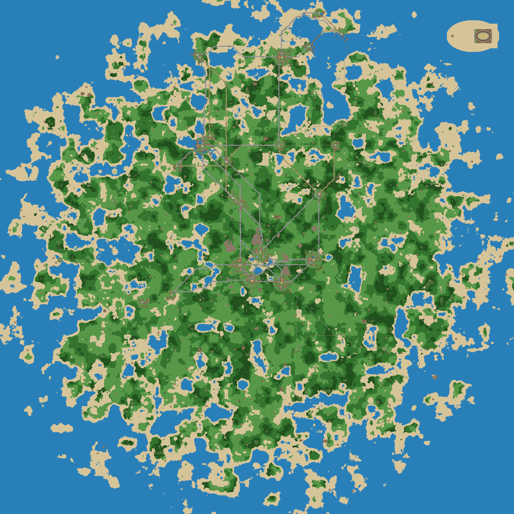
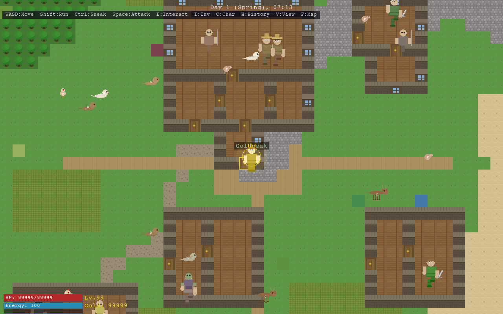
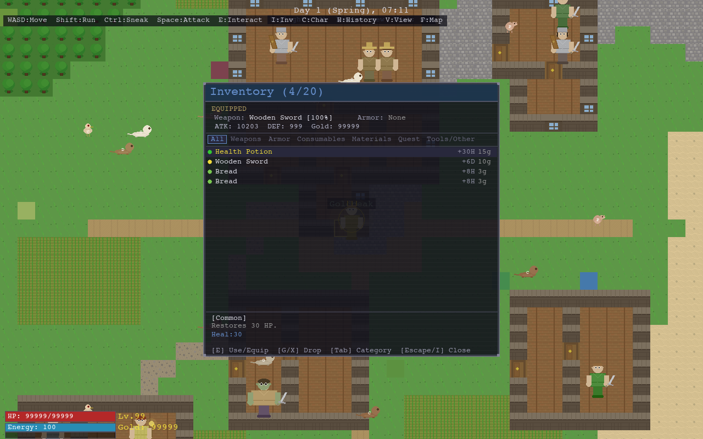
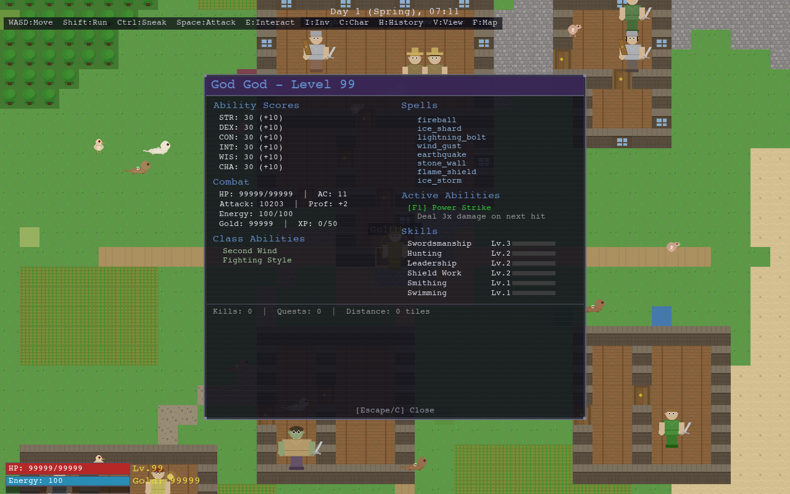
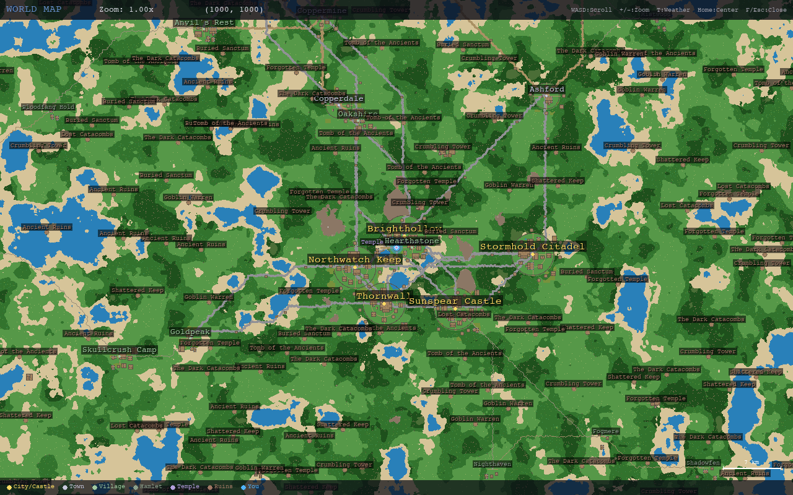
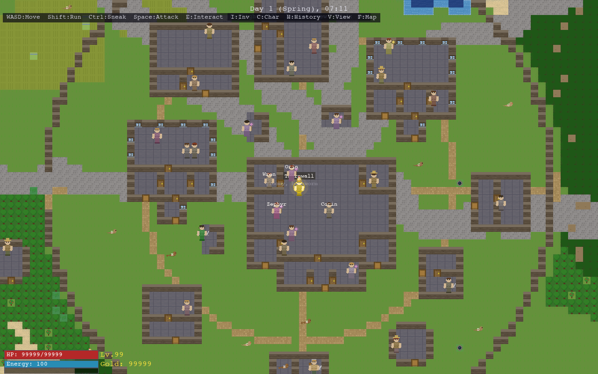
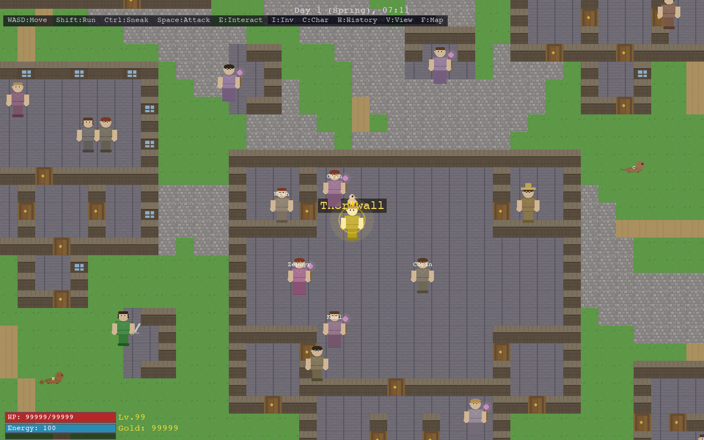
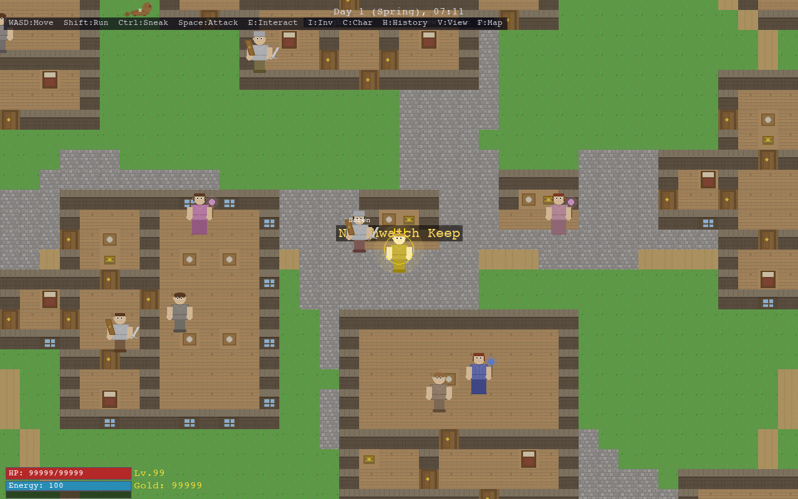
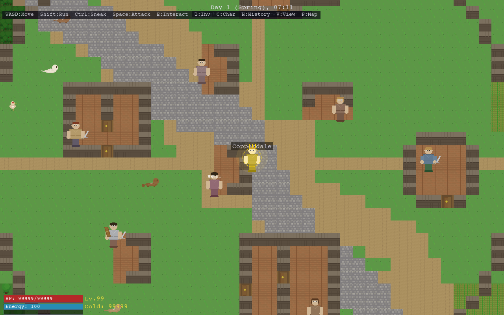
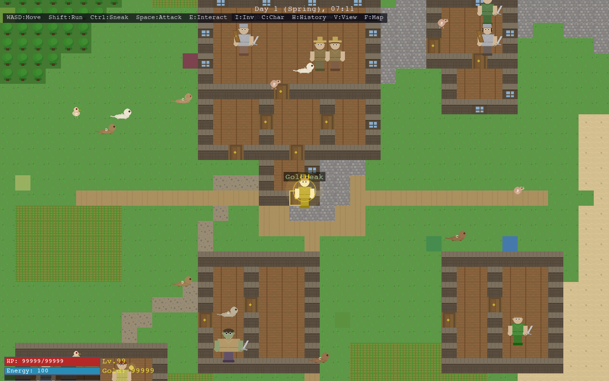

# Autonomous World

A living medieval open-world RPG built with Pygame-CE, combining D&D 5e mechanics with Sims-style social simulation. Every NPC has real jobs, emotions, memories, relationships, and goals. Gods watch from above, souls persist across lifetimes, and the world evolves whether you're watching or not.

**315 Python modules | 670+ NPCs | 71 professions | 102 spells | 70+ creature types | 10,000 x 10,000 tile world**



## Quick Start

```bash
pip install pygame-ce numpy
python play.py
```

### Launch Options

| Flag | Description |
|------|-------------|
| `--wizard` | Start as level 20 Wizard with all spells |
| `--multiplayer` | Host a multiplayer server |
| `--ai-companion {type}` | Host + AI co-player (explorer/warrior/trader/socialite) |
| `--join HOST:PORT` | Join a remote game |
| `--dev` | Developer character creation screen |
| `--skip-chargen` | Skip character creation |

## Controls

| Key | Action |
|-----|--------|
| WASD | Move |
| E | Interact / Talk (NPCs and intelligent monsters) |
| Space | Melee attack (nearest hostile in facing direction) |
| Left-click | Target entity (set as combat target / cast spell at) |
| Right-click | Cancel targeting / deselect target |
| 1-9 | Cast spell (enters targeting mode, click to aim) |
| S | Toggle spell list overlay |
| I | Inventory |
| C | Character sheet |
| Q | Quest log |
| F | World map |
| M | Minimap |
| R | Recruit NPC to party |
| Tab | Cycle nearby NPCs |
| T | Free-text chat (in dialog) |
| H | Historical chronicles |
| V | Toggle view mode (Strategy / Adventure / 3D) |
| F6 | Toggle entity overlays (All / Minimal / Off) |
| F12 | Screenshot |
| Escape | Pause menu / cancel targeting |

See [CONTROLS.md](CONTROLS.md) for the full key binding reference.

---

## Core Systems

### Living NPCs (670+ per world)



- **71 professions** — Merchant, Baker, Blacksmith, Healer, Farmer, Guard, Innkeeper, Alchemist, plus all D&D classes (Fighter, Wizard, Cleric, Rogue, Ranger, Paladin, Bard, Monk, Warlock, Sorcerer, Druid, Barbarian)
- **Plutchik emotions** — 8 primary emotions (joy, trust, fear, surprise, sadness, disgust, anger, anticipation) with secondary combinations. Emotions affect dialog, work output, and social behavior
- **Big Five personality** — Openness, conscientiousness, extraversion, agreeableness, neuroticism shape NPC decision-making
- **Dynamic relationships** — Trust (-100 to +100) evolves through interactions. NPCs form friendships, rivalries, romantic bonds, and grudges
- **Needs system** — Hunger, thirst, rest, social. NPCs eat, drink, sleep, and seek company autonomously
- **Memory** — NPCs remember conversations, gifts, insults, and events. Past interactions change future dialog

### Deep Conversations

- **Relationship-aware** — Hostile NPCs greet differently from friends
- **Emotion-aware** — Sad NPCs talk about their troubles, angry NPCs are short-tempered, joyful NPCs are generous
- **Body language** — Contextual gestures and expressions based on emotional state
- **Memory-driven** — NPCs reference past conversations and events
- **Needs-driven** — Hungry NPCs mention food, lonely NPCs are grateful for company
- **Free-text chat** — Type anything to NPCs; LLM generates contextual responses, or scripted fallback without LLM
- **Gift giving** — Give items to NPCs to improve relationships. Food to hungry NPCs gives extra bonuses
- **Class-specific dialog** — Wizards discuss magic, Bards perform songs, Rogues offer shady deals, Clerics heal

### Trading & Economy

- **Shops** — Merchants, blacksmiths, healers, bakers, innkeepers, alchemists, armourers sell profession-specific goods
- **Barter** — Trade with any NPC who has inventory. Items sold at 80% value
- **NPC-to-NPC trade** — NPCs buy food when hungry, healing items when hurt, weapons when needed
- **Trade caravans** — Merchants travel between settlements carrying goods
- **Dynamic pricing** — Supply and demand affect market prices



### Quest System

- **8 quest types** — Kill, fetch, deliver, investigate, escort, diplomacy, defend, bounty hunt
- **All completable** — Quest progress tracked through kills, item collection, location visits, NPC interactions, and settlement defense
- **Accept or reject** — Refusing a king's quest angers the court. Refusing a friend hurts their feelings
- **Failure consequences** — Abandoned quests cost gold and reputation. Failed defense quests damage settlement morale. Failed escorts kill the escorted NPC
- **Quest chains** — Multi-part storylines with escalating rewards
- **Player-assigned tasks** — Ask NPCs to hunt creatures, gather supplies, scout areas, guard locations, or deliver items. They work autonomously and report back

### NPC Social Life

NPCs have the same rich interactions with each other as with the player:

- **Gossip networks** — Information spreads through NPC conversations
- **Skill teaching** — Experienced NPCs teach skills to friends
- **Emotional support** — Friends comfort each other when sad
- **Danger warnings** — NPCs warn friends about threats
- **Food sharing** — Friends share food with hungry companions
- **16 social interaction types** — Chat, gossip, argue, flirt, comfort, spar, study, pray, trade, challenge, intimidate, betray, and more
- **Marriage and children** — NPCs marry, have children with Darwinian trait inheritance

### Combat (D&D 5e-based)

- **Ability scores** — STR, DEX, CON, INT, WIS, CHA with D&D modifiers
- **102 spells** across 8 schools, spell levels 1-9 with mouse-based targeting, range circles, and AoE preview
- **Body part damage** — 6 body parts (head, torso, arms, legs), 8 damage types (slash, pierce, blunt, fire, cold, lightning, acid, poison), wound tracking, bleeding, infection
- **Equipment** — Weapons, armor, potions with durability
- **Tactical combat** — Real-time with target selection, flanking bonuses, morale, and party management
- **Elemental terrain effects** — Fire spreads to combustible tiles, ice freezes water into walkable sheets, acid dissolves walls



### Siege Warfare

- **Siege engines** — Battering ram, catapult, trebuchet, siege tower
- **16 military unit types** — Infantry, archers, cavalry, siege engineers with rock-paper-scissors matchups
- **5 formations** — Shield wall, wedge, skirmish line, siege formation, defensive circle
- **Lanchester combat model** — Realistic large-scale battle resolution
- **Fortifications** — Settlement walls, moats, guard towers, gates

### Intelligent Monster Societies

- **Monster governance** — Orcs, goblins, kobolds, gnolls, bandits, undead each have governance models
- **Monster dialog** — Orcs demand tribute, goblins offer trades, bandits toll roads, gnolls threaten
- **Monster settlements** — Orc strongholds, goblin warrens, kobold mines, undead crypts with populations

---

## World



- **10,000 x 10,000 tile world** (chunked) with procedural terrain generation
- **Volcanic island** — El Hierro-inspired landmass with ridged multifractal mountain spines
- **River network** — D8 flow accumulation with 3-level hierarchy (major/medium/stream), priority-flood sink filling for lakes, estuary erosion at river mouths
- **Biomes** — Whittaker classification (temperature x moisture) producing 70+ terrain types
- **Settlements** — Hamlets, villages, towns, cities, castles with coherent street networks, market plazas, race-specific buildings, and 63 building blueprints with interiors
- **Climate model** — Pressure systems, temperature gradients, precipitation, seasons
- **Weather effects** — Rain, snow, storms, fog, heat waves affect activities and emotions
- **Day/night cycle** — NPCs follow schedules, darkness affects visibility
- **Roads** — A* terrain-aware inter-settlement road pathfinding
- **Ecology** — 70+ creature types, wildlife, domesticated animals, natural resources

### Settlements

Settlements range from small hamlets to walled cities, each with profession-specific buildings, street networks, and populations of autonomous NPCs.

| | |
|---|---|
|  |  |
| *City — strategy view (16px)* | *City — adventure view (32px)* |
|  |  |
| *Castle — adventure view* | *Town — adventure view* |

### Day/Night Cycle

The world transitions through 7 lighting phases. NPCs follow daily schedules, and visibility changes with the time of day.

| | |
|---|---|
|  |  |
| *Midday* | *Night* |

---

## Soul & Religion

- **500+ tracked souls** — Persist across lifetimes with echo memories
- **Ghost state** — Souls can linger as ghosts before reincarnation
- **7 gods** — Tharion (war), Sylvana (nature), Verithos (knowledge), Morwen (death), Auriel (commerce), Lyria (love), Xaotl (chaos)
- **Prayer system** — Pray to gods for miracles and blessings
- **Heresy** — Faith erosion, religious conversion, cult founding, schism
- **Undead** — 7 types that feed on souls, necromancers, consecrated zones

## Health & Disease

- **13 diseases** — Plague, fever, infections with contagious spread
- **Seasonal illness** — Weather-driven sickness patterns
- **Medicine** — Healers, herbs, potions, treatment mechanics
- **Mental health** — Depression, anxiety, PTSD, mania, paranoia, addiction, grief, burnout

## AI Systems

- **AI Storyteller** — 4 personalities (balanced/aggressive/peaceful/chaotic) manage dramatic tension
- **LLM integration** — Optional Claude/GPT for dynamic NPC dialog and decision making
- **God mode** — Floating panel with parameter tweaker, live Python console, hot reload

## Multiplayer

- **TCP networking** — Server/client architecture for 2 players
- **AI co-player** — Claude-driven companion with personality types (explorer, warrior, trader, socialite)
- **Cooperative quests** — Shared quest progression
- **PvP arena** — Colosseum with betting system
- **Player trading** — Direct item exchange between players

---

## Graphics

Three rendering modes with procedural character and creature animation:

1. **Strategy View (16px)** — Full world overview with all entities and particles
2. **Adventure View (32px, 2.5D)** — Detailed body parts, poses, mounts, equipment visibility
3. **3D OpenGL View** — Full 3D rendering with proper perspective

| | |
|---|---|
|  |  |
| *Strategy view (16px tiles)* | *Adventure view (32px tiles)* |

### Visual Features

- Procedural body parts rendering (head, torso, arms, legs) with walk cycles
- 13 creature visual templates covering 70+ creature types
- 7 action poses (lying, sitting, kneeling, working, combat, fishing, alert)
- 5 mount types with mounted rider rendering
- Siege engines, vehicles, and fortifications (2D and 3D)
- Profession-specific sprites (guard helmets, farmer straw hats, wizard hats, merchant aprons)
- Water animation (shore foam, river flow, entity ripples)
- Fire/torch dynamic lighting with flickering glow
- Terrain edge blending with dithered gradients
- Day/night transition tinting (7 phases)
- Construction scaffolding with progress indicators

---

## Architecture

```
game/
  main.py                — Game loop orchestrator
  core/
    player.py            — Player entity with D&D mechanics
    npc.py               — NPC entity (71 professions, emotions, memory)
    dialog_trees.py      — Rich context-aware dialog system
    items.py             — Item definitions
    creature.py          — Monsters and wildlife (70+ types)
  systems/
    simulation.py        — SimulationManager (52 subsystems, 7 mixins)
    quests.py            — Quest generation, tracking, consequences
    emotions.py          — Plutchik emotion system
    social.py            — NPC relationships and social interactions
    social_dynamics.py   — Love, contempt, joy spreading, grief
    combat.py            — D&D combat mechanics with body damage
    magic.py             — 102 spells, enchanting, alchemy
    magic_spells.py      — Spell definitions across 8 schools
    warfare.py           — 16 unit types, formations, Lanchester model
    siege.py             — Siege engines and fortifications
    climate.py           — Weather and climate model
    health.py            — Disease, infection, medicine, mental health
    souls.py             — Soul persistence and reincarnation
    pantheon.py          — God AI and prayer system
    children.py          — Reproduction and inheritance
    monster_society.py   — Intelligent creature governance
    ...                  — 130+ more subsystem modules
  ui/
    renderer.py          — Strategy view (16px) with particles
    renderer_adventure.py — Adventure view (32px, 2.5D)
    renderer_3d.py       — 3D OpenGL view
    character_anim.py    — Procedural NPC body parts and animation
    player_anim.py       — Player rendering (mortal/ghost/god)
    creature_anim.py     — Creature animation system
    creatures/           — Per-type creature sprite templates (13 templates)
    poses.py             — Entity pose system (7 action poses)
    mount_render.py      — Mounted entity rendering (5 mount types)
    object_sprites.py    — Siege engines, vehicles, fortifications
    panels.py            — Dialog, shop, inventory, quest UI
    god_mode.py          — Developer tools and parameter tweaker
  world/
    world.py             — ChunkedWorld (10K x 10K tiles)
    chunk_generator.py   — Procedural terrain generation
    settlements.py       — Settlement placement and planning
    blueprint_library.py — 63 building blueprints
    river_gen.py         — D8 flow accumulation river network
    dungeon_gen.py       — Dungeon generation with BSP
    history_sim.py       — Historical world simulation
  ai/
    llm.py               — LLM integration (Claude/OpenAI)
    prompts.py           — NPC voice and context building
    ai_player.py         — AI companion personality
  network/
    server.py            — TCP game server
    client.py            — Network client
    ai_player.py         — Claude-driven AI companion
    coop_quests.py       — Cooperative quest system
    pvp_arena.py         — PvP colosseum
  audio/
    sound_system.py      — Audio manager
    music_system.py      — Background music
    sound_generators.py  — Procedural sound effects
  data/
    dnd.py               — D&D 5e rules, classes, races
    job_classes.py       — 71 profession mappings
    ecology.py           — Creature types and wildlife
    save_game.py         — Save/load system
```

## God Mode

Start in god mode for development/testing:
- Invulnerable with fast movement
- Live Python console (~) for executing code against game state
- Parameter tweaker for adjusting settings in real-time
- Hot reload for modifying game modules without restart
- Dashboard for inspecting settlements, NPCs, economy, and world state

## Visual Test Viewers

The `viewers/` directory contains standalone test viewers for inspecting all visual elements:

| Viewer | Command | What it shows |
|--------|---------|---------------|
| NPC Characters | `python viewers/test_character_anim.py` | All NPC classes/races in all view scales |
| Creatures (2D) | `python viewers/test_creature_viewer.py` | All 70+ creature types with animation |
| Creatures (3D) | `python viewers/test_creature_3d_viewer.py` | 3D creature templates |
| Player | `python viewers/test_player_viewer.py` | Mortal/ghost/god modes |
| Poses (2D) | `python viewers/test_poses_viewer.py` | All action poses |
| Poses (3D) | `python viewers/test_poses_3d_viewer.py` | 3D poses |
| Creature Poses | `python viewers/test_creature_poses_viewer.py` | Sleeping/resting/combat poses |
| Mounts (2D) | `python viewers/test_mount_viewer.py` | Rider/mount combinations |
| Mounts (3D) | `python viewers/test_mount_3d_viewer.py` | 3D mounted riders |
| Buildings (2.5D) | `python viewers/test_building_25d_viewer.py` | All 63 blueprints with roofs |
| Buildings (3D) | `python viewers/test_building_3d_viewer.py` | OpenGL building viewer |
| Terrain | `python viewers/test_terrain_viewer.py` | All 70+ terrain types |
| World Objects | `python viewers/test_objects_viewer.py` | Siege engines, vehicles, walls |
| World Objects (3D) | `python viewers/test_objects_3d_viewer.py` | 3D siege engines and vehicles |

## Screenshots

Press F12 in-game, or use the headless screenshot system:

```python
from game.ui.screenshot import HeadlessGame
hg = HeadlessGame(seed=42)
hg.capture("gameplay")
hg.capture("world_map", zoom=2.0)
hg.capture("character_sheet")
```

## License

Personal project. Not yet licensed for distribution.
